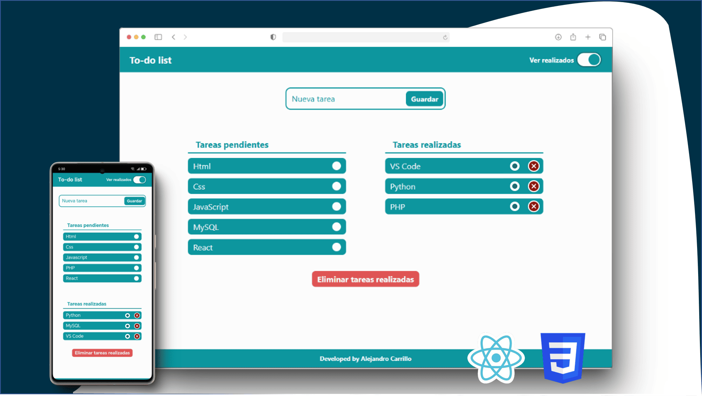
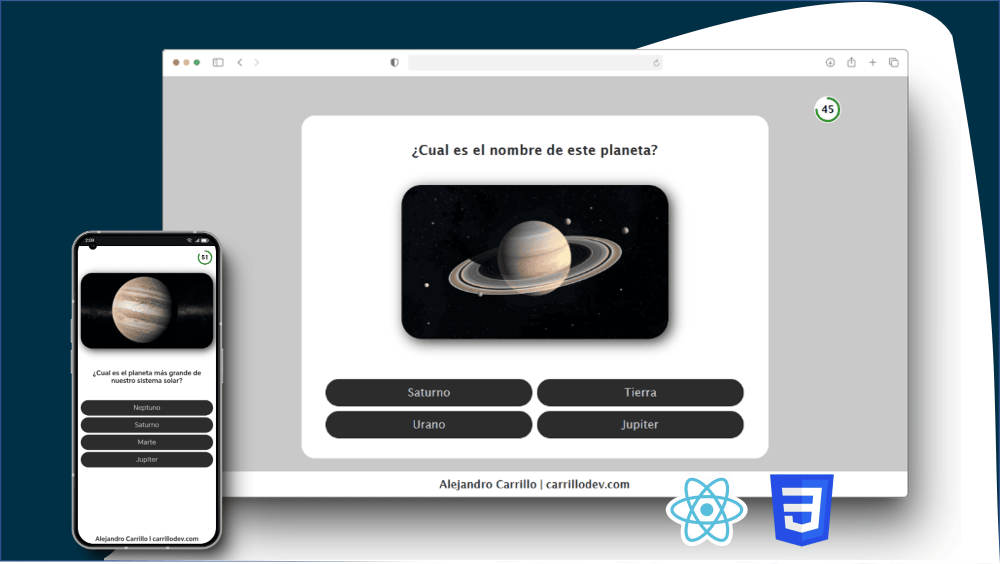
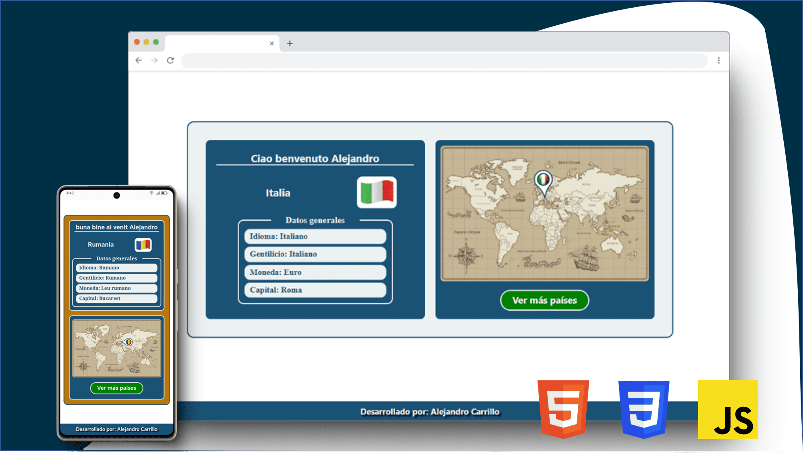

 

<!-- Typing SVG animado -->

---

## 🧑🏻‍💻 Sobre mí

Soy **Desarrollador de Software** con formación en Programación de Software (SENA). Me apasiona crear interfaces web modernas, funcionales y con buena experiencia de usuario. Estoy en búsqueda activa de oportunidades donde pueda aportar valor y seguir creciendo profesionalmente.

- 🔭 Actualmente trabajando en proyectos personales con **React**
- 🌱 Aprendiendo cada día más sobre **JavaScript avanzado** y **buenas prácticas**
- 💼 **Disponible para trabajar** — 
- 📍 Colombia 🇨🇴

---

## 💼 Experiencia Laboral

### 👨‍💻 Desarrollador Front-end | *Cinndev S.A.S.*
📅 *Junio 2024 – Octubre 2025*
- Desarrollo y mantenimiento de interfaces de usuario (UI) responsivas y accesibles utilizando **React** y **JavaScript (ES6+)**.
- Integración de funcionalidades a través de **APIs REST** trabajando de la mano con el equipo Back-end.

### 💻 Programador Full-Stack | *Pv&gm construcciones S.A.S.*
📅 *Mayo 2023 – Junio 2024*
- Desarrollo de sistemas de gestión interna y control de gastos con **Python** (Back-end) y **React** (Front-end).
- Administración de bases de datos relacionales mediante **PostgreSQL**.
- Automatización de procesos financieros y reportes para optimizar la toma de decisiones.

---

## 🚀 Proyectos Destacados

<table>
  <tr>
    <td align="center" width="33%">
      
        
      <b>✅ Todo List App</b>
       
      Gestor de tareas con persistencia de datos usando <strong>LocalStorage</strong>. Construido con React.
        
      
        
      
      
    </td>
    <td align="center" width="33%">
      
        
      <b>🧠 Quiz App</b>
       
      Aplicación interactiva de preguntas y respuestas. Construida con <strong>React + Vite</strong>.
        
      
        
      
      
    </td>
    <td align="center" width="33%">
      
        
      <b>🌍 Países e Idiomas</b>
       
      App interactiva para explorar países y sus idiomas. Desarrollada con <strong>HTML, CSS y JS</strong> puro.
        
      
        
      
      
      
    </td>
  </tr>
</table>

---

## 🛠️ Tecnologías

  
  &nbsp;
  
  &nbsp;
  
  &nbsp;
  
  &nbsp;
  
  &nbsp;
  
  &nbsp;
  
  &nbsp;
  

---

## 📊 Estadísticas de GitHub

---

## 🌐 Encuéntrame en

  
  
  
  
  

---

  💼 <b>Abierto a oportunidades laborales</b> — No dudes en contactarme 👆
   
   
  

